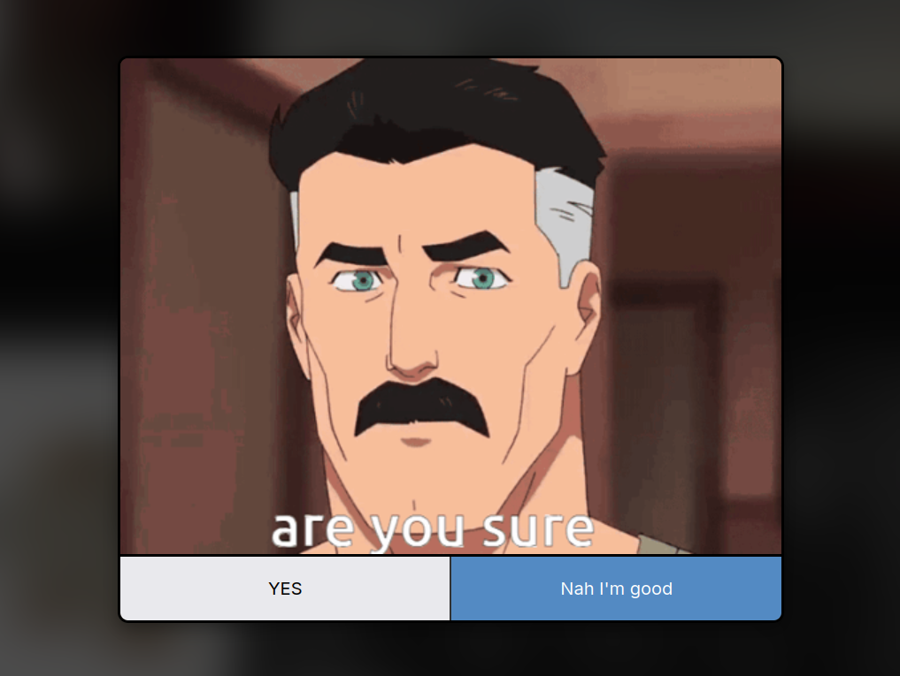

</img>
# Are you sure?
## Have Nolan make sure that if you really want to access the content and do something better with yout time.

## Preview

### How it works?
1. Click on any YouTube video.
2. Nolan Grayson will ask for your confirmaton.

## Installation

### Chromium Based
1. Clone the repository `git clone https://github.com/funinkina/are-you-sure`
2. To to [chrome://extensions](chrome://extensions) and enable **Developer Mode**.
3. Click on **Load Unpacked**.
4. Select the `manifest.json` file from the chrome folder.
5. The extension should be loaded. Try clicking on any YouTube video
   

### Firefox Based
> [!NOTE]
> Waiting for approval on [Mozilla Addons](https://addons.mozilla.org/). In the meanwhile, you can look how to install it manually.

## Current Limitations
- Only works on YouTube as of now
  
## TODO
- [x] Add Chromium Support
- [ ] Make it work for twitter, reddit, etc
- [ ] Show the content info you want to visit in the popup